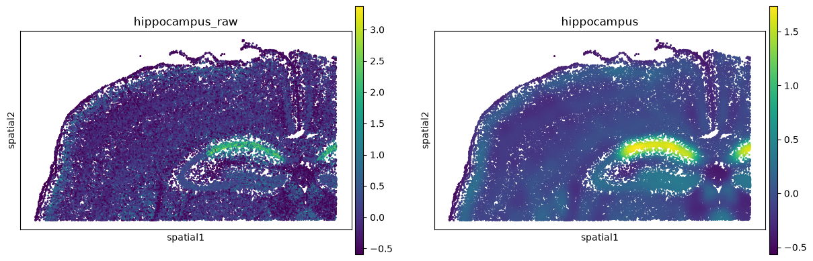
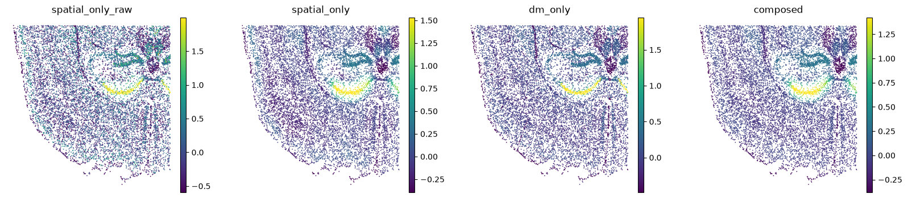

# spatial-smooth

**Composable smoothing of gene-set signatures over space and cell state.**

📖 **[Documentation](https://settylab.github.io/spatial-smooth/)** · [Tutorial notebook](notebooks/tutorial.ipynb) · [Setty Lab](https://setty-lab.org)

> ## ⚠️ For visualization only
>
> **This package makes spatial regions easier to see. Its output is a picture, not data.**
>
> Smoothing deliberately makes neighbouring cells look like one another — which is what you want
> when you are trying to *spot* where a program is active, and what you must never hand to a
> statistical test. A smoothed score is spatially autocorrelated by construction: the cells stop
> being independent observations, so differential expression, differential abundance, clustering,
> correlations and p-values computed on smoothed values will report "significant" structure in
> pure noise.
>
> **Look at the smoothed values. Run the statistics on the raw ones** — every call writes
> `adata.obs[f"{name}_raw"]` for exactly that purpose — with a method that accounts for spatial
> dependence.

Every cell is measured independently, so a per-cell signature score is dominated by dropout and
sampling noise: a speckle of dots in which a real anatomical region is genuinely hard to spot.
Smoothing lets neighbouring cells borrow statistical strength, turning that speckle into a
coherent field you can read at a glance.

```python
import spatial_smooth as ss

ss.smooth(adata, ["Prox1", "Neurod6", "Wfs1", "Fibcd1"], "hippocampus")
ss.pl.signature(adata, "hippocampus")
```



*A four-gene hippocampal signature on a public 10x Xenium mouse-brain section (36,419 cells). Left:
the raw mean z-score. Right: after one line of smoothing — the dentate-gyrus C-shape, the CA
fields and the cortical layers resolve. 0.9 seconds.*

---

## Install

```bash
pip install "spatial-smooth[all]"
```

Only `numpy`, `scipy`, `pandas` and `anndata` are required. Everything else is an optional extra,
imported lazily and reported with the exact `pip install` line when missing: `dm` (`kompot`),
`embedding` (`palantir`), `plot` (`scanpy`), `squidpy`, `kde` (`KDEpy`). Run
`ss.check_dependencies()` to see where you stand.

**Your data needs exactly two things:** log-normalised expression in `adata.X` (or a named
`layer`), and coordinates in `adata.obsm["spatial"]`.

---

## Which neighbours count?

That is the scientific choice, and it is one argument.

```python
ss.smooth(adata, genes, "sig")                     # spatial only   (the default)
ss.smooth(adata, genes, "sig", steps="dm")         # cell state only
ss.smooth(adata, genes, "sig", steps="dm+spatial") # both, in that order
```



*The same signature, four ways. **Spatial** smoothing averages over physically adjacent cells.
**Cell-state** smoothing averages over transcriptionally similar cells (a diffusion map), without
using position at all. **Composed** does the manifold first, then the tissue.*

A pipeline is an ordered list of steps; each smooths the expression matrix over one embedding and
hands the result to the next. Doing just one of the two is a one-element pipeline, not a special
case. Pass `Step` objects instead of a shorthand for full control:

```python
ss.smooth(adata, genes, "sig", store_genes=True, steps=[
    ss.KompotGP(basis="DM_EigenVectors", ls_factor=10.0, n_landmarks=8000),
    ss.KnnGaussian(basis="spatial", k=64, sigma_factor=4.0),
])
```

| shorthand | pipeline | | shorthand | pipeline |
|---|---|---|---|---|
| `"spatial"` *(default)* | `[KnnGaussian()]` | | `"spatial+dm"` | `[KnnGaussian(), KompotGP()]` |
| `"dm"` | `[KompotGP()]` | | `"spatial-kde"` | `[Kde()]` |
| `"dm+spatial"` | `[KompotGP(), KnnGaussian()]` | | `"spatial-gp"` | GP over tissue coordinates |

---

## Compute once, plot forever

Results are written into the `AnnData`, and plotting reads **only** those keys — so an expensive
smoothing is done once.

| key | contents |
|---|---|
| `obs[name]` | smoothed signature score |
| `obs[f"{name}_raw"]` | unsmoothed score, same genes and combiner |
| `obsm[f"{name}_smoothed"]` | `(n_obs, n_genes)` smoothed expression (`store_genes=True`) |
| `uns["spatial_smooth"][name]` | provenance: genes, pipeline, resolved bandwidths, version |

```python
adata.write_h5ad("smoothed.h5ad")
# ... later, elsewhere, with neither kompot nor palantir installed:
adata = anndata.read_h5ad("smoothed.h5ad")
ss.provenance(adata, "sig")["steps"]   # exactly what ran, with the bandwidths it resolved
ss.pl.signature(adata, "sig")          # renders in ~60 ms; recomputes nothing
```

That is a contract, not a hope: a test blocks `kompot`, `KDEpy` and `palantir` at the import
machinery, replaces every compute entry point with a function that raises, and *then* renders a
reloaded file.

---

## Plotting wraps scanpy and squidpy

`ss.pl.signature` sets `color` from the stored provenance and forwards every other keyword
**verbatim** to `squidpy.pl.spatial_scatter`, `scanpy.pl.embedding`, or `scanpy.pl.spatial`
(`backend=`, default `"auto"`).

```python
ss.pl.signature(adata, "sig", backend="squidpy", cmap="magma", figsize=(6, 6))
ss.pl.compare(adata, ["spatial_only", "dm_only", "composed"], raw=True, ncols=4)
```

Two conventions are normalised for you, because leaving them to the backend gave different
pictures of the same tissue. A **spatial basis is always drawn in image convention** — y
increasing downward, equal aspect — so scanpy and squidpy agree on which way is up. And `size`
means different things per backend — marker *area* in `scanpy`, a *scale factor* in `squidpy` — so
it is documented rather than translated, and the scanpy path gets a density-aware default
(`plot.default_marker_size`) so a dense section renders as tissue rather than speckle. Pass `size`
yourself to override.

---

## Choosing a smoother

| step | engine | full slide (~1.6 × 10⁵ cells) | gives you |
|---|---|---|---|
| `KnnGaussian` | Gaussian kernel over `k` spatial neighbours | ~1 s | the default; fast, sharp |
| `Kde` | FFT Nadaraya-Watson on a fine grid | ~1 s | a rendered field; resolution-bound |
| `KompotGP` | Gaussian-process regression (kompot/mellon) | minutes | a length scale, a posterior, fit-on-one-condition |

Bandwidths default to a multiple of the median nearest-neighbour distance, so the same factor
smooths the same amount whether coordinates are in microns or millimetres.

**Quote `sigma_effective`, never `sigma_nominal`.** `KnnGaussian` truncates its Gaussian at the `k`-th
neighbour, so the bandwidth the data actually sees is set by whichever of `sigma` and the
`k`-neighbour radius binds first — and since that radius follows a neighbour *count*, the kernel
is implicitly density-adaptive. `provenance()` records `kernel_mass_retained`, `sigma_effective`
and its spread across cells alongside `sigma_nominal`, and warns when the truncation
starts to bite. The default `k=400` keeps ~96% of the kernel mass, so the two nearly agree.

> **One caveat.** Over a diffusion map, kompot's native `ls_factor=10` is right. Over *physical*
> coordinates it is ~200× the cell spacing and collapses the field into a single global gradient.
> Use `ls_factor≈0.3` there — which is what the `"spatial-gp"` shorthand does.

See [Concepts](https://settylab.github.io/spatial-smooth/concepts.html) for the composition and
scoring semantics, and why gene-level smoothing costs nothing in correctness.

## License

MIT. See [LICENSE](LICENSE).
